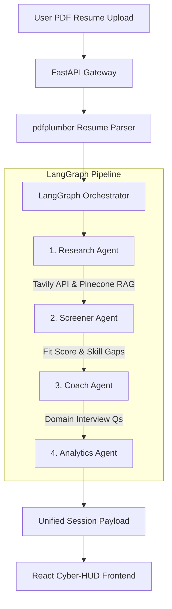

# 🚀 Career Intelligence OS

> An autonomous, AI-powered career guidance & resume intelligence platform built with **LangGraph 4-Agent Pipeline**, **FastAPI**, **React**, **Pinecone RAG Vector Search**, and **Groq Llama-3.3-70B**.


---

## 📌 Overview

**Career Intelligence OS** is a state-of-the-art career optimization suite designed to give job seekers and engineering candidates an unfair competitive advantage. By pairing real-time Web Intelligence (Tavily API) and RAG (Pinecone Vector DB) with an autonomous 4-agent LangGraph workflow, the platform evaluates resume-job role alignment, performs pinpoint ATS compatibility audits, generates domain-specific technical interview questions, and provides actionable career growth roadmaps.

---

## 🌟 Key Features

### 🤖 1. Autonomous 4-Agent LangGraph Pipeline
- **🔍 Research Agent**: Conducts live web market research (via Tavily Search API) and RAG retrieval over domain job standards.
- **🎯 Screener Agent**: Evaluates resume-job fit with pinpoint accuracy (0–100%), identifying matched skills and critical skill gaps.
- **💬 Coach Agent**: Generates 100% domain-specific technical/architectural interview questions tailored to the candidate's exact target role (AI Developer, React Engineer, Data Scientist, Finance Specialist).
- **📊 Analytics Agent**: Provides target market salary benchmarks, skill acquisition roadmaps, and career growth trajectories.

### 🎯 2. ATS Checker & Compatibility Audit
- **Pinpoint ATS Pass Probability %**: Calculates exact candidate ATS pass rate using a weighted scoring model across Keyword Density (30%), Format Compatibility (25%), Section Structure (25%), and Content Quality (20%).
- **3-Tab Findings Report**: Categorizes audit results into **⚠ Issues**, **🔧 Actionable Fixes**, and **✓ Passed Format Checks**.
- **Red Flag Detector**: Flags multi-column tables, graphics, non-standard symbols, and missing contact information.

### ✍ 3. Resume AI Editor & Keyword Matrix
- **🟢 Correct Keywords Present**: Highlights exact technical terms detected in the candidate's resume matching the target job role.
- **🔴 Missing Keywords Needed**: Identifies critical target job role keywords missing from the candidate's resume.
- **⚡ High-Impact ATS Words**: Recommends high-converting action verbs (*Architected*, *Engineered*, *Spearheaded*, *Optimized*) and domain power keywords.
- **Positive & Negative Impact Analysis**: Displays clear breakdown of factors helping vs hurting the candidate's ATS match.

### 💬 4. AI Interview Practice Coach Room
- Interactive practice room with real-time answer evaluation by the Coach Agent.
- Provides numeric score (0–10), constructive recruiter feedback, noted strengths, areas for improvement, and ideal answer hints.

### 📊 5. Workspace Analytics & Session History
- Tracks past resume analyses, score progressions, and skill gap trends.
- Interactive Recharts graphs and historical log table.

---

## 🏗 System Architecture



---

## 🛠 Tech Stack

### Frontend
- **Framework**: React 18 (Vite)
- **Styling**: Custom Cyber HUD Glassmorphic Styling + Tailwind CSS
- **Animations**: Framer Motion
- **Data Visualization**: Recharts
- **HTTP Client**: Axios with JWT Interceptors

### Backend
- **Framework**: Python 3.10+ FastAPI
- **AI Agent Framework**: LangGraph & LangChain
- **LLM Engine**: Groq `llama-3.3-70b-versatile`
- **Web Search**: Tavily Search API
- **Vector DB / RAG**: Pinecone & Sentence Transformers (`all-MiniLM-L6-v2`)
- **PDF Processing**: `pdfplumber` / `pdfminer.six`
- **Authentication**: JWT Bearer Tokens & `passlib` (bcrypt)

---

## 📂 Project Structure

```text
career_intelligence_os/
├── backend/
│   ├── agents/
│   │   ├── research_agent.py      # Tavily Web Search & RAG
│   │   ├── screener_agent.py      # Resume fit scoring & skill gap detection
│   │   ├── coach_agent.py         # Domain-specific Q&A generation & evaluation
│   │   ├── analytics_agent.py     # Salary benchmarks & learning roadmaps
│   │   ├── ats_agent.py           # Pinpoint ATS score & keyword matrix
│   │   ├── resume_builder_agent.py# High-impact ATS keyword rewrite engine
│   │   └── orchestrator.py        # LangGraph StateGraph pipeline
│   ├── auth/
│   │   ├── jwt_handler.py         # Token creation & verification
│   │   └── dependencies.py        # Role-Based Access Control
│   ├── rag/
│   │   ├── embedder.py            # SentenceTransformer embeddings
│   │   └── pinecone_client.py     # Pinecone vector store operations
│   ├── utils/
│   │   ├── pdf_parser.py          # Robust PDF text extraction
│   │   └── pdf_generator.py       # ReportLab PDF exporter
│   ├── main.py                    # FastAPI application entrypoint
│   ├── routes.py                  # API route handlers
│   └── config.py                  # Environment variable configuration
├── frontend/
│   ├── src/
│   │   ├── components/            # Cyber HUD UI components
│   │   ├── pages/                 # React page routes (ATS, Coach, Editor, etc.)
│   │   ├── utils/                 # Axios instance & auth helpers
│   │   ├── App.jsx                # Router definition
│   │   └── index.css              # Cyber HUD glassmorphism design tokens
│   ├── package.json
│   └── vite.config.js
├── requirements.txt               # Backend Python dependencies
└── README.md
```

---

## ⚡ Quick Start Guide

### Prerequisites
- **Python**: `v3.10` or higher
- **Node.js**: `v18` or higher
- **Groq API Key**: Required for Llama-3.3 LLM inference ([Get Key Here](https://console.groq.com/))
- **Tavily API Key**: Required for live web research ([Get Key Here](https://tavily.com/))

---

### 1. Backend Setup

```bash
# Clone the repository
git clone https://github.com/Mugunthan688/Career_Intelligence.git
cd Career_Intelligence

# Create Python virtual environment
python -m venv venv

# Activate virtual environment
# On Windows (PowerShell):
.\venv\Scripts\Activate.ps1
# On Linux/macOS:
source venv/bin/activate

# Install dependencies
pip install -r requirements.txt

# Create environment configuration (.env)
cp .env.example .env
```

Add your API keys to `.env`:
```env
GROQ_API_KEY=your_groq_api_key_here
TAVILY_API_KEY=your_tavily_api_key_here
JWT_SECRET=your_secret_key_here
PINECONE_API_KEY=your_pinecone_api_key_here
```

Start the FastAPI server:
```bash
python -m uvicorn backend.main:app --reload --port 8000
```
> The API server will run at `http://localhost:8000`. API Documentation is available at `http://localhost:8000/docs`.

---

### 2. Frontend Setup

Open a new terminal window:

```bash
cd career_intelligence_os/frontend

# Install Node dependencies
npm install

# Start Vite dev server
npm run dev
```
> The frontend application will launch at `http://localhost:5173`.

---

## 🔒 Security & Authentication

- **Authentication**: JWT tokens passed in the `Authorization: Bearer <token>` header.
- **Password Security**: Passwords hashed using `bcrypt`.
- **Role-Based Access Control**: Differentiates between `job_seeker` and `admin` roles.

---

## 📄 License

This project is licensed under the **MIT License**. See [LICENSE](LICENSE) for details.

---

<p align="center">
Made with ❤️ by <strong>Mugunthan M</strong> & powered by <strong>Google Antigravity AI</strong>
</p>
